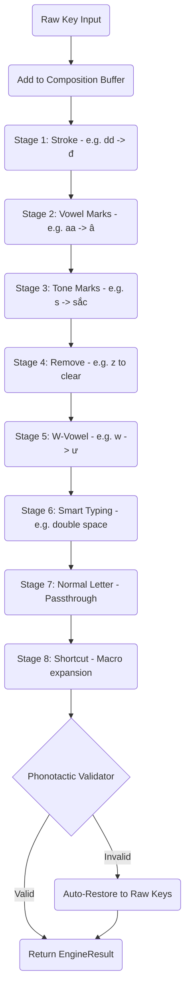

# 🤝 Developer Onboarding Guide

> Welcome to Lotus Core! This guide is designed to onboard developers, linguists, and contributors into our high-performance Vietnamese input engine ecosystem.

---

## 🏛️ Project Philosophy

Lotus Core is more than just a key-mapper. It is a strictly **phonotactic, linguistic-first** engine built for the most demanding developer environments. We prioritize correctness, zero dependencies, and high performance (sub 0.1ms latency).

## 🔤 Understanding Vietnamese Phonotactics

To work on the core engine, you need a basic understanding of how Vietnamese syllables are constructed. The engine strictly validates syllables before applying any transformations.

A Vietnamese syllable consists of up to four components:
1. **Initial (Âm đầu)**: The starting consonant (e.g., `b`, `ch`, `ng`). Optional (e.g., `ai` has no initial).
2. **Glide (Âm đệm)**: A rounded vowel sound (`o` or `u`). Modifies the nucleus.
3. **Nucleus (Âm chính)**: The main vowel or vowel cluster (e.g., `a`, `iêu`, `ươu`). Required. Tone marks are applied here.
4. **Coda / Final (Âm cuối)**: The ending consonant or semi-vowel (e.g., `c`, `nh`, `i`). Optional.

*Example: "chuyện" = Initial (`ch`) + Glide (`u`) + Nucleus (`yê`) + Coda (`n`), Tone (Nặng `.`)*

Our engine decomposes strings into these structures to enforce linguistic rules, preventing invalid outputs like `tẽt` (from English "test").

## ⚙️ The 8-Stage Processing Pipeline

Lotus Core follows a strict **pipeline architecture**. Every keystroke goes through these stages sequentially:

## 🛠️ How to Contribute

1. **Issues**: Use our issue templates for [Bug Reports](../.github/ISSUE_TEMPLATE/bug_report.md) or [Feature Requests](../.github/ISSUE_TEMPLATE/feature_request.md). We distinguish between **Linguistic Bugs** (incorrect Vietnamese rendering) and **Technical Bugs** (crashes, memory leaks).
2. **Pull Requests**:
   - Fork the repository.
   - Create a feature branch.
   - Ensure your code follows the existing style (`clang-format` is your friend).
   - Run tests using `./dev.sh` before submitting.
   - Write clear, concise commit messages.

## 💻 Development Setup

See the main [`README.md`](../README.md) for build instructions and setup details.

## 📄 License

By contributing, you agree that your contributions will be licensed under the project's GPL-3.0 License.
